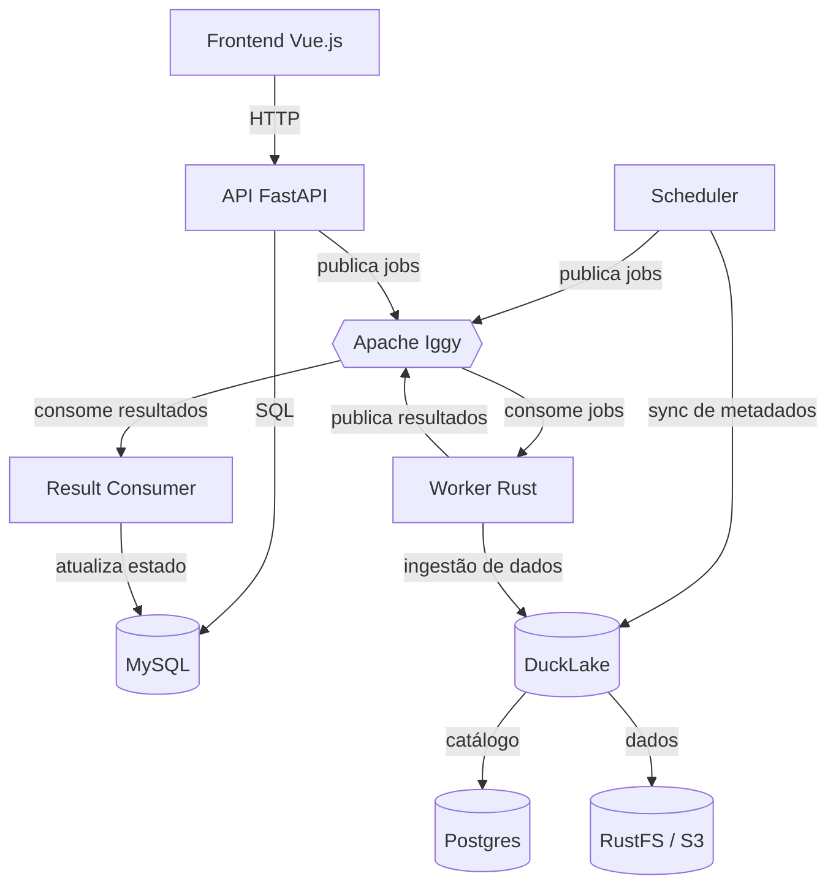

# CKAN Ingestor

Pipeline de ingestão de dados do portal [CKAN](https://ckan.org) para um lakehouse baseado em [DuckLake](https://ducklake.io) (DuckDB + catálogo Postgres + dados em S3/RustFS).

O projeto é composto por dois serviços principais:

- **`ingestor_orchestrator`** — API (FastAPI), frontend (Vue 3), scheduler de sincronização de metadados e consumer de resultados.
- **`ckan-ingestor-rs`** — workers Rust: `worker` para ingestão de dados e `worker-coordinator` para metadata e topologia Iggy.

## Arquitetura



### Componentes

| Componente | Tecnologia | Descrição |
|---|---|---|
| API | FastAPI + SQLAlchemy async | Endpoints REST para jobs, datasets, instâncias, sync e dashboard |
| Frontend | Vue.js 3 + TypeScript + Vite | Dashboard para visualizar e gerenciar jobs |
| Scheduler | asyncio | Sincroniza metadados do CKAN e enfileira recursos desatualizados |
| Result Consumer | Python + Apache Iggy | Consome `ckan-ingestor/job-results` e atualiza o MySQL |
| Worker | Rust + Iggy SDK + DuckDB | Consome jobs e executa a ingestão de dados |
| Fila | Apache Iggy 0.8.0 | Comunicação assíncrona entre API/scheduler, worker e result consumer |
| Estado | MySQL 8.0 | Persistência do estado dos jobs |
| Lakehouse | DuckLake | DuckDB + catálogo Postgres + dados em S3/RustFS |

### Fluxo de mensagens (Apache Iggy)

Todos os tópicos pertencem ao stream `ckan-ingestor`. Os tópicos de ingestão
usam a quantidade configurada; os dois tópicos de metadata usam uma partição.

| Tópico | Direção | Descrição |
|---|---|---|
| `jobs` | API/scheduler → worker | Jobs de ingestão |
| `jobs-retry` | API → worker | Jobs com retry |
| `job-results` | worker → result consumer | Resultados da ingestão |
| `ckan_metadata_sync` | API/scheduler → worker-coordinator | Comandos de sincronização de metadados CKAN |
| `ckan_metadata_sync_result` | worker-coordinator → result consumer | Resultados da sincronização de metadados |

## Estrutura do repositório

```
.
├── ckan-ingestor-rs/              # Workers Rust (dados e coordinator de metadata)
├── ingestor_orchestrator/
│   ├── backend/                   # API FastAPI, scheduler e result consumer
│   └── frontend/                  # Dashboard Vue.js
├── charts/ingestor-orchestrator/  # Helm chart
├── analytics/                     # Notebooks e consultas analíticas (DuckDB/marimo)
├── infra/                         # Terraform (legado, era Dagster/Pulsar)
└── .gitlab-ci.yml                 # Pipeline de CI/CD
```

## Como rodar localmente

O jeito mais simples é subir todos os serviços com Docker Compose:

```bash
cd ingestor_orchestrator
docker compose up -d
```

Serviços disponíveis:

| Serviço | URL |
|---|---|
| API | http://localhost:8000 (docs em `/docs`) |
| Apache Iggy HTTP | http://localhost:3000 |
| RustFS Console | http://localhost:9101 |

O compose sobe MySQL, Apache Iggy, RustFS, Postgres (catálogo DuckLake), a API, o worker Rust e o `db-init` (migrações Alembic).

## Testes

### Python (orquestrador)

```bash
cd ingestor_orchestrator/backend
uv run pytest tests/ -q

# Na raiz do repositório
cd ../..
uv run ruff check
```

### Rust (worker)

```bash
cd ckan-ingestor-rs
cargo fmt -- --check
cargo clippy -- -D warnings
cargo test
```

## Build de imagens

O `.gitlab-ci.yml` constrói e publica as imagens no registry do GitLab:

| Imagem | Dockerfile |
|---|---|
| `$CI_REGISTRY_IMAGE/orchestrator` | `ingestor_orchestrator/Dockerfile` |
| `$CI_REGISTRY_IMAGE/worker` | `ckan-ingestor-rs/Dockerfile` (`ckan_ingestor_consumer`) |
| `$CI_REGISTRY_IMAGE/worker-coordinator` | `ckan-ingestor-rs/Dockerfile` (`ckan_worker_coordinator`) |

## Configuração

### Orquestrador (prefixo `INGEST_ORCH_`)

| Variável | Padrão | Descrição |
|---|---|---|
| `INGEST_ORCH_MYSQL_HOST` | `localhost` | Host do MySQL |
| `INGEST_ORCH_MYSQL_PORT` | `3306` | Porta do MySQL |
| `INGEST_ORCH_MYSQL_USER` | `root` | Usuário do MySQL |
| `INGEST_ORCH_MYSQL_PASSWORD` | (vazio) | Senha do MySQL |
| `INGEST_ORCH_MYSQL_DATABASE` | `ingestor_orchestrator` | Database do MySQL |
| `INGEST_ORCH_IGGY_ADDRESS` | `localhost:8090` | Endpoint TCP do Iggy |
| `INGEST_ORCH_IGGY_USERNAME` | `iggy` | Usuário do Iggy |
| `INGEST_ORCH_IGGY_PASSWORD` | `iggy` | Senha do Iggy |
| `INGEST_ORCH_IGGY_STREAM` | `ckan-ingestor` | Stream da aplicação |
| `INGEST_ORCH_IGGY_TOPIC` | `jobs` | Tópico principal de jobs |
| `INGEST_ORCH_IGGY_TOPIC_RETRY` | `jobs-retry` | Tópico de retry |
| `INGEST_ORCH_IGGY_TOPIC_RESULTS` | `job-results` | Tópico de resultados |
| `INGEST_ORCH_IGGY_METADATA_SYNC_TOPIC` | `ckan_metadata_sync` | Tópico de comandos de metadados |
| `INGEST_ORCH_IGGY_METADATA_SYNC_RESULT_TOPIC` | `ckan_metadata_sync_result` | Tópico de resultados de metadados |
| `INGEST_ORCH_IGGY_RESULT_GROUP_ID` | `ckan-result-consumer` | Consumer group de resultados |
| `INGEST_ORCH_IGGY_METADATA_SYNC_RESULT_GROUP_ID` | `ckan-metadata-sync-result-consumer` | Consumer group dos resultados de metadados |
| `INGEST_ORCH_IGGY_JOB_PARTITIONS` | `10` | Partições do tópico principal |
| `INGEST_ORCH_IGGY_RETRY_PARTITIONS` | `10` | Partições do tópico de retry |
| `INGEST_ORCH_IGGY_RESULT_PARTITIONS` | `1` | Partições do tópico de resultados |
| `INGEST_ORCH_SCHEDULER_INTERVAL_MINUTES` | `480` | Intervalo do scheduler (minutos) |
| `INGEST_ORCH_DEBUG` | `false` | Modo debug |

### Worker Rust

| Variável | Padrão | Descrição |
|---|---|---|
| `IGGY_ADDRESS` | `localhost:8090` | Endpoint TCP do Iggy |
| `IGGY_USERNAME` | `iggy` | Usuário do Iggy |
| `IGGY_PASSWORD` | `iggy` | Senha do Iggy |
| `IGGY_STREAM` | `ckan-ingestor` | Stream da aplicação |
| `IGGY_TOPIC` | `jobs` | Tópico principal |
| `IGGY_TOPIC_RETRY` | `jobs-retry` | Tópico de retry |
| `IGGY_TOPIC_RESULTS` | `job-results` | Tópico de resultados |
| `IGGY_GROUP_ID` | `ckan-worker` | Consumer group do worker |
| `IGGY_JOB_PARTITIONS` | `10` | Consumer slots e partições do tópico principal |
| `IGGY_RETRY_PARTITIONS` | `10` | Consumer slots e partições do tópico de retry |
| `DUCKLAKE_DATABASE` | (obrigatório) | Database DuckDB local |
| `DUCKLAKE_CATALOG_URI` | (obrigatório) | URI do catálogo DuckLake (Postgres) |
| `S3_ENDPOINT` | `rustfs:9000` | Endpoint S3/RustFS |
| `S3_BUCKET` | `warehouse` | Bucket de dados |
| `S3_ACCESS_KEY_ID` | `admin` | Access key do S3 |
| `S3_SECRET_ACCESS_KEY` | `password` | Secret key do S3 |
| `S3_USE_SSL` | `false` | Usar SSL no S3 |
| `RUST_LOG` | `info` | Nível de log |

### Worker coordinator Rust

O `worker-coordinator` inicializa de forma idempotente o stream e os tópicos Iggy e processa exclusivamente a sincronização de metadata. Ele usa `IGGY_ADDRESS`, `IGGY_USERNAME`, `IGGY_PASSWORD`, `IGGY_STREAM`, `IGGY_TOPIC`, `IGGY_TOPIC_RETRY`, `IGGY_TOPIC_RESULTS`, `IGGY_METADATA_SYNC_TOPIC`, `IGGY_METADATA_SYNC_RESULT_TOPIC`, `IGGY_METADATA_SYNC_GROUP_ID`, `IGGY_JOB_PARTITIONS`, `IGGY_RETRY_PARTITIONS` e `IGGY_RESULT_PARTITIONS`, além da mesma configuração DuckLake/S3 do worker. API e worker preservam sua criação idempotente de topologia como proteção durante a inicialização.

## Deploy

O deploy é feito via GitOps com ArgoCD, usando o Helm chart em `charts/ingestor-orchestrator`. A configuração de deploy (Application, ExternalSecret, Crossplane) fica no repositório `argocd-applications` (`noctcloud/argocd-applications`).

Antes do primeiro sync, crie `IGGY_ROOT_PASSWORD` no OCI Vault. No cutover
Kafka → Iggy, pause API e worker, registre jobs `PENDING`/`PROCESSING`, sincronize
Iggy e a nova versão da aplicação e recrie os jobs inventariados pelo fluxo
normal de sincronização.

## Licença

[GNU Affero General Public License v3.0](LICENSE)
