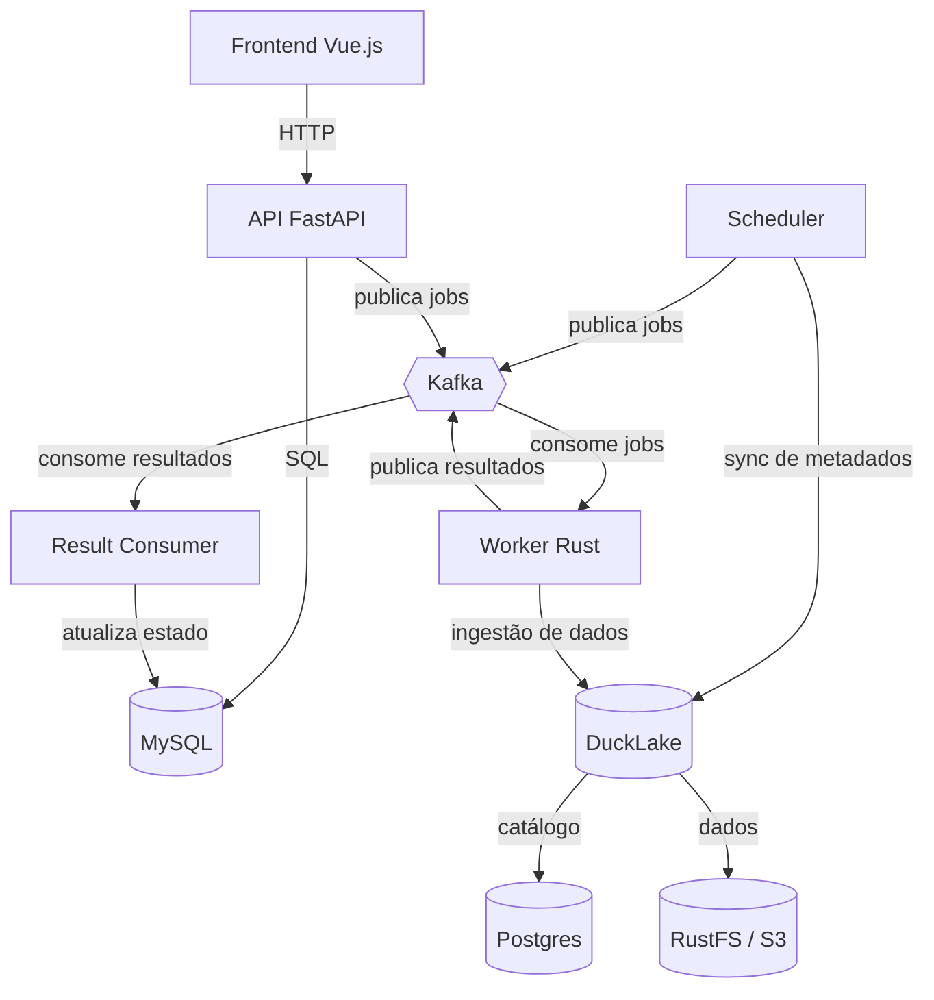

# CKAN Ingestor

Pipeline de ingestão de dados do portal [CKAN](https://ckan.org) para um lakehouse baseado em [DuckLake](https://ducklake.io) (DuckDB + catálogo Postgres + dados em S3/RustFS).

O projeto é composto por dois serviços principais:

- **`ingestor_orchestrator`** — API (FastAPI), frontend (Vue 3), scheduler de sincronização de metadados e consumer de resultados.
- **`ckan-ingestor-rs`** — worker em Rust que consome jobs do Kafka e executa a ingestão de dados.

## Arquitetura



### Componentes

| Componente | Tecnologia | Descrição |
|---|---|---|
| API | FastAPI + SQLAlchemy async | Endpoints REST para jobs, datasets, instâncias, sync e dashboard |
| Frontend | Vue.js 3 + TypeScript + Vite | Dashboard para visualizar e gerenciar jobs |
| Scheduler | asyncio | Sincroniza metadados do CKAN e enfileira recursos desatualizados |
| Result Consumer | Python + Kafka | Consome `ckan.ingest.jobs_result` e atualiza o MySQL |
| Worker | Rust + rdkafka + DuckDB | Consome jobs e executa a ingestão de dados |
| Fila | Kafka (Strimzi) | Comunicação assíncrona entre API/scheduler, worker e result consumer |
| Estado | MySQL 8.0 | Persistência do estado dos jobs |
| Lakehouse | DuckLake | DuckDB + catálogo Postgres + dados em S3/RustFS |

### Fluxo de mensagens (Kafka)

| Tópico | Direção | Descrição |
|---|---|---|
| `ckan.ingest.jobs` | API/scheduler → worker | Jobs de ingestão |
| `ckan.ingest.jobs.retry` | API → worker | Jobs com retry |
| `ckan.ingest.jobs_result` | worker → result consumer | Resultados da ingestão |

## Estrutura do repositório

```
.
├── ckan_ingestor/                 # Biblioteca Python (sincronização de metadados)
├── ckan-ingestor-rs/              # Worker Rust (ingestão de dados)
├── ingestor_orchestrator/
│   ├── backend/                   # API FastAPI, scheduler e result consumer
│   └── frontend/                  # Dashboard Vue.js
├── charts/ingestor-orchestrator/  # Helm chart
├── analytics/                     # Notebooks e consultas analíticas (DuckDB/marimo)
├── infra/                         # Terraform (legado, era Dagster/Pulsar)
└── .gitlab-ci.yml                 # Pipeline de CI/CD
```

## Como rodar localmente

O jeito mais simples é subir todos os serviços com Docker Compose:

```bash
cd ingestor_orchestrator
docker compose up -d
```

Serviços disponíveis:

| Serviço | URL |
|---|---|
| API | http://localhost:8000 (docs em `/docs`) |
| Redpanda Console (Kafka) | http://localhost:8080 |
| RustFS Console | http://localhost:9101 |

O compose sobe MySQL, Kafka, RustFS, Postgres (catálogo DuckLake), a API, o worker Rust e o `db-init` (migrações Alembic).

## Testes

### Python (orquestrador e biblioteca)

```bash
# Raiz — biblioteca ckan_ingestor
uv sync
uv run pytest tests/ -q
uv run ruff check

# Backend do orquestrador
cd ingestor_orchestrator/backend
uv run pytest tests/ -q
```

### Rust (worker)

```bash
cd ckan-ingestor-rs
cargo fmt -- --check
cargo clippy -- -D warnings
cargo test
```

## Build de imagens

O `.gitlab-ci.yml` constrói e publica as imagens no registry do GitLab:

| Imagem | Dockerfile |
|---|---|
| `$CI_REGISTRY_IMAGE/orchestrator` | `ingestor_orchestrator/Dockerfile` |
| `$CI_REGISTRY_IMAGE/worker` | `ckan-ingestor-rs/Dockerfile` |

## Configuração

### Orquestrador (prefixo `INGEST_ORCH_`)

| Variável | Padrão | Descrição |
|---|---|---|
| `INGEST_ORCH_MYSQL_HOST` | `localhost` | Host do MySQL |
| `INGEST_ORCH_MYSQL_PORT` | `3306` | Porta do MySQL |
| `INGEST_ORCH_MYSQL_USER` | `root` | Usuário do MySQL |
| `INGEST_ORCH_MYSQL_PASSWORD` | (vazio) | Senha do MySQL |
| `INGEST_ORCH_MYSQL_DATABASE` | `ingestor_orchestrator` | Database do MySQL |
| `INGEST_ORCH_KAFKA_BOOTSTRAP_SERVERS` | `localhost:9092` | Bootstrap servers do Kafka |
| `INGEST_ORCH_KAFKA_TOPIC` | `ckan.ingest.jobs` | Tópico principal de jobs |
| `INGEST_ORCH_KAFKA_TOPIC_RETRY` | `ckan.ingest.jobs.retry` | Tópico de retry |
| `INGEST_ORCH_KAFKA_GROUP_ID` | `ckan-worker` | Group ID do Kafka |
| `INGEST_ORCH_SCHEDULER_INTERVAL_MINUTES` | `480` | Intervalo do scheduler (minutos) |
| `INGEST_ORCH_DEBUG` | `false` | Modo debug |

### Worker Rust

| Variável | Padrão | Descrição |
|---|---|---|
| `KAFKA_BOOTSTRAP_SERVERS` | `localhost:9092` | Bootstrap servers do Kafka |
| `KAFKA_TOPIC` | `ckan.ingest.jobs` | Tópico principal |
| `KAFKA_TOPIC_RETRY` | `ckan.ingest.jobs.retry` | Tópico de retry |
| `KAFKA_GROUP_ID` | `ckan-worker-rs` | Group ID do Kafka |
| `DUCKLAKE_DATABASE` | (obrigatório) | Database DuckDB local |
| `DUCKLAKE_CATALOG_URI` | (obrigatório) | URI do catálogo DuckLake (Postgres) |
| `S3_ENDPOINT` | `rustfs:9000` | Endpoint S3/RustFS |
| `S3_BUCKET` | `warehouse` | Bucket de dados |
| `S3_ACCESS_KEY_ID` | `admin` | Access key do S3 |
| `S3_SECRET_ACCESS_KEY` | `password` | Secret key do S3 |
| `S3_USE_SSL` | `false` | Usar SSL no S3 |
| `RUST_LOG` | `info` | Nível de log |

## Deploy

O deploy é feito via GitOps com ArgoCD, usando o Helm chart em `charts/ingestor-orchestrator`. A configuração de deploy (Application, ExternalSecret, Crossplane) fica no repositório `argocd-applications` (`noctcloud/argocd-applications`).

## Licença

[GNU Affero General Public License v3.0](LICENSE)
