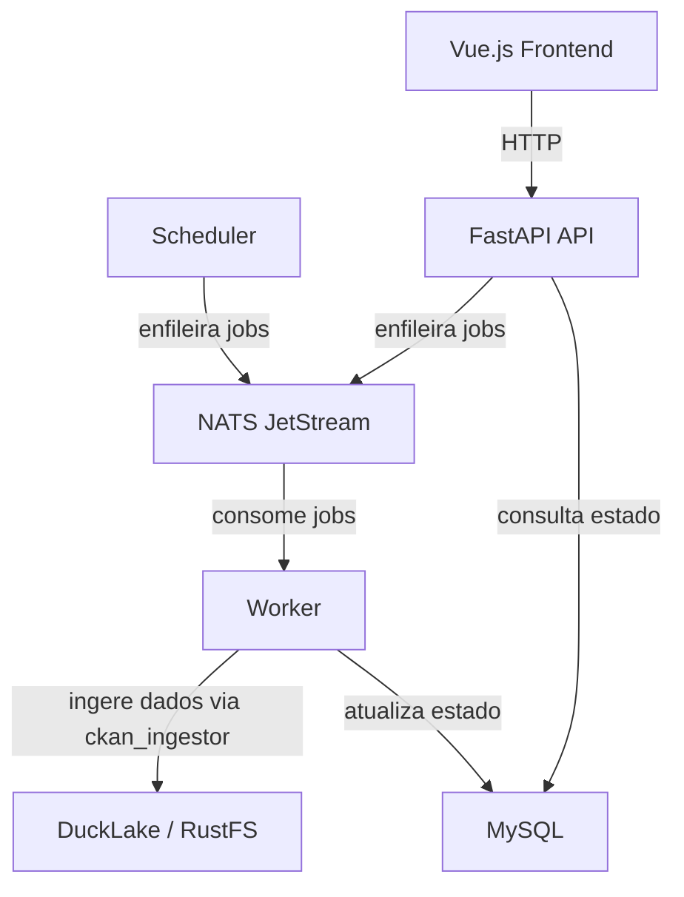

# CKAN Orchestrator

Substituto leve do Dagster para orquestração de ingestão de dados do portal CKAN.

## Arquitetura



| Componente | Tecnologia | Descrição |
|---|---|---|
| **API** | FastAPI | Endpoints REST para disparar e monitorar jobs de ingestão |
| **Worker** | NATS consumer | Consome mensagens da fila e executa a ingestão via `ckan_ingestor` |
| **Scheduler** | asyncio loop | Detecta recursos desatualizados no DuckLake e enfileira jobs (substitui o sensor Dagster) |
| **Frontend** | Vue.js 3 + TypeScript | Dashboard para visualizar e gerenciar jobs |
| **NATS** | JetStream | Fila de mensagens persistente para comunicação assíncrona |
| **MySQL** | 8.0 | Armazena estado dos jobs via SQLAlchemy async |

## Como rodar com Docker

```bash
# Copie o arquivo de environment
cp .env.example .env
# Edite o .env com suas configurações

# Suba os serviços
docker compose up -d

# Com frontend (perfil dev)
docker compose --profile dev up -d
```

A API estará disponível em `http://localhost:8000`. A documentação interativa em `http://localhost:8000/docs`.

## Como rodar sem Docker

### Pré-requisitos

- Python 3.11+
- MySQL 8.0
- NATS Server com JetStream

### Instalação

```bash
# Instalar uv (se necessário)
curl -LsSf https://astral.sh/uv/install.sh | sh

# Instalar dependências do projeto base
cd /caminho/para/ckan-ingestor
uv pip install -e .

# Instalar o orchestrator
cd ingestor_orchestrator/backend
uv pip install -e .
```

### Executar

```bash
# API
orchestrator-api
# ou: uvicorn ingestor_orchestrator.main:app --host 0.0.0.0 --port 8000

# Worker
orchestrator-worker

# Scheduler
orchestrator-scheduler

# Frontend (dev)
cd ../frontend
npm install
npm run dev
```

## Endpoints da API

| Método | Path | Descrição |
|---|---|---|
| `GET` | `/health` | Health check |
| `GET` | `/api/dashboard/stats` | Estatísticas do dashboard |
| `GET` | `/api/jobs` | Lista jobs (filtros: `status`, `resource_id`, `limit`, `offset`) |
| `GET` | `/api/jobs/{id}` | Detalhe do job com resultados |
| `POST` | `/api/jobs` | Cria e enfileira um novo job |
| `POST` | `/api/jobs/{id}/retry` | Retry de um job com falha |
| `DELETE` | `/api/jobs/{id}` | Remove um job pending ou failed |

## Modelo de Dados

### CkanDataJob

| Campo | Tipo | Descrição |
|---|---|---|
| `id` | UUID | Identificador único do job |
| `resource_id` | string | ID do recurso CKAN |
| `resource_name` | string | Nome do recurso |
| `resource_url` | string | URL do recurso |
| `resource_format` | string | Formato (CSV, JSON, PDF, etc.) |
| `status` | enum | `pending` → `processing` → `completed` / `failed` |
| `idempotency_key` | string | Chave de idempotência (= resource_id) |
| `created_at` | datetime | Data de criação |
| `started_at` | datetime | Data de início do processamento |
| `completed_at` | datetime | Data de conclusão |

### CkanDataJobResult

| Campo | Tipo | Descrição |
|---|---|---|
| `id` | UUID | Identificador único |
| `job_id` | UUID (FK) | Referência ao job |
| `success` | boolean | Se a ingestão teve sucesso |
| `error_message` | text | Mensagem de erro (se falha) |
| `error_trace` | text | Stack trace completo (se falha) |
| `dataset_preview` | JSON | Preview das primeiras linhas (se sucesso) |
| `rows_processed` | integer | Número de linhas processadas |
| `created_at` | datetime | Data de criação do resultado |

## Idempotência

Cada job usa `resource_id` como chave de idempotência:

1. Antes de criar um job, verifica se já existe um job `pending` ou `processing` para o mesmo recurso.
2. Se existir, retorna o job existente sem criar duplicata.
3. A ingestão em si já é idempotente: usa `CREATE OR REPLACE TABLE` e merge/upsert no DuckLake.
4. Jobs `failed` podem ser retentados (botão Retry), o que reseta o status para `pending`.

## Configuração

Todas as variáveis de ambiente usam o prefixo `INGEST_ORCH_`.

| Variável | Padrão | Descrição |
|---|---|---|
| `INGEST_ORCH_MYSQL_HOST` | `localhost` | Host do MySQL |
| `INGEST_ORCH_MYSQL_PORT` | `3306` | Porta do MySQL |
| `INGEST_ORCH_MYSQL_USER` | `root` | Usuário do MySQL |
| `INGEST_ORCH_MYSQL_PASSWORD` | (vazio) | Senha do MySQL |
| `INGEST_ORCH_MYSQL_DATABASE` | `ingestor_orchestrator` | Database do MySQL |
| `INGEST_ORCH_NATS_URL` | `nats://localhost:4222` | URL do NATS |
| `INGEST_ORCH_NATS_STREAM` | `CKAN_INGEST` | Nome do stream JetStream |
| `INGEST_ORCH_NATS_SUBJECT` | `ckan.ingest.resource` | Subject NATS para publicar jobs |
| `INGEST_ORCH_CKAN_URL` | `https://dados.pbh.gov.br/` | URL do portal CKAN |
| `INGEST_ORCH_SCHEDULER_INTERVAL_MINUTES` | `480` | Intervalo do scheduler em minutos (padrão: 8h) |
| `INGEST_ORCH_DEBUG` | `false` | Modo debug |

Variáveis do `ckan_ingestor` (prefixo `DUCKLAKE_` e `S3_`) também são necessárias para o Worker e Scheduler.
