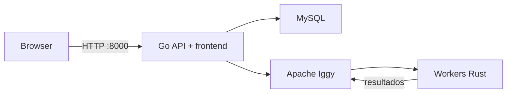

# CKAN Orchestrator

Aplicação Go responsável pela API HTTP, frontend Vue, comunicação com Apache
Iggy, scheduler, consumo de resultados e persistência no MySQL.

## Arquitetura



O frontend usa paths relativos `/api`; HTTP e HTTPS são terminados pelo mesmo
origin, incluindo ambientes expostos pelo OrbStack. A aplicação publica apenas
a porta `8000`.

## Docker

```bash
cp ingestor_orchestrator/.env.example ingestor_orchestrator/.env
docker compose -f ingestor_orchestrator/docker-compose.yml up -d
```

- Aplicação: `http://localhost:8000`
- OpenAPI: `http://localhost:8000/openapi.json`
- Swagger UI: `http://localhost:8000/docs`
- Health: `http://localhost:8000/health`
- Readiness: `http://localhost:8000/ready`

O serviço `db-init` executa `orchestrator-go migrate`. As migrations SQL ficam
embutidas no binário e aceitam tanto um database vazio quanto um database
legado no head Alembic `020`.

## Desenvolvimento

Pré-requisitos: Go 1.26+, Node.js 22+, MySQL 8.0 e Apache Iggy 0.8.

```bash
cd ingestor_orchestrator/go
go run ./cmd/orchestrator migrate
go run ./cmd/orchestrator

cd ../frontend
npm ci
npm run dev
```

## API

| Método | Path | Descrição |
|---|---|---|
| `GET` | `/api/instances/` | Lista instâncias CKAN |
| `POST` | `/api/instances/` | Cria uma instância |
| `GET`, `DELETE` | `/api/instances/{id}` | Consulta ou remove uma instância |
| `GET` | `/api/jobs/` | Lista jobs com filtros e paginação |
| `GET` | `/api/jobs/{id}` | Detalhe e resultados do job |
| `POST` | `/api/jobs/{id}/retry` | Reenvia um job com falha |
| `GET` | `/api/resources/` | Lista recursos agregados |
| `GET` | `/api/resources/{id}` | Detalhe, histórico e preview |
| `GET` | `/api/datasets/` | Lista datasets agregados |
| `GET` | `/api/dashboard/stats` | Estatísticas por instância |
| `GET` | `/api/syncs/`, `/api/syncs/{id}` | Histórico de sincronizações |
| `POST` | `/api/metadata/sync[/{instance_id}]` | Dispara sincronização |

## Configuração principal

| Variável | Padrão | Descrição |
|---|---|---|
| `INGEST_ORCH_GO_ADDRESS` | `:8000` | Endereço HTTP |
| `INGEST_ORCH_STATIC_DIR` | `/app/frontend` | Assets compilados do frontend |
| `INGEST_ORCH_MYSQL_HOST` | `localhost` | Host MySQL |
| `INGEST_ORCH_MYSQL_PORT` | `3306` | Porta MySQL |
| `INGEST_ORCH_MYSQL_USER` | `root` | Usuário MySQL |
| `INGEST_ORCH_MYSQL_PASSWORD` | vazio | Senha MySQL |
| `INGEST_ORCH_MYSQL_DATABASE` | `ingestor_orchestrator` | Database MySQL |
| `INGEST_ORCH_IGGY_ADDRESS` | `localhost:8090` | Endpoint TCP do Iggy |
| `INGEST_ORCH_IGGY_STREAM` | `ckan-ingestor` | Stream Iggy |
| `INGEST_ORCH_SCHEDULER_INTERVAL_MINUTES` | `480` | Intervalo do scheduler |
